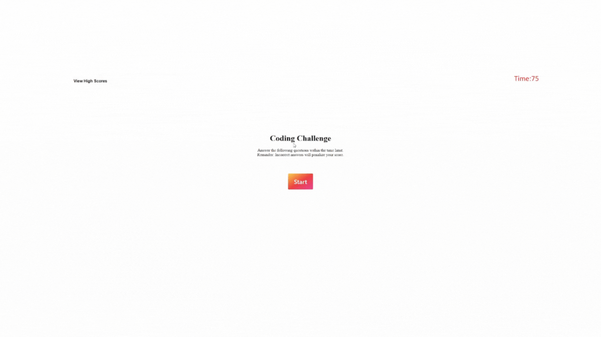

# Web APIs Challenge: Code Quiz

## General Info
In Challenge 4 I had to build a timed coding quiz with multiple-choice questions.
The app runs in the browser, and will features dynamically updated HTML and CSS powered 
by JavaScript code that you write. 

## Deployed Link
https://mlmcdan1.github.io/Coding-Quiz/

